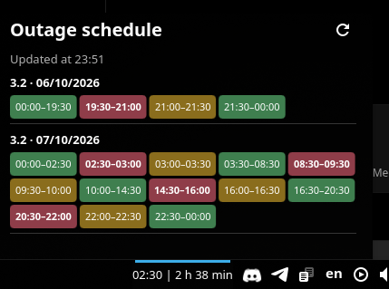

# PoltavaOblEnergo Queue Schedule — KDE Plasma widget

It fetches the official schedule immediately and every 30 minutes; the refresh button forces an update, and it fires an urgent notification when an outage is soon.

The UI is available in English and Ukrainian; it follows the Plasma/KDE language setting.



Install on Plasma 6:

```sh
kpackagetool6 --type Plasma/Applet --install poe-queue-widget
```
